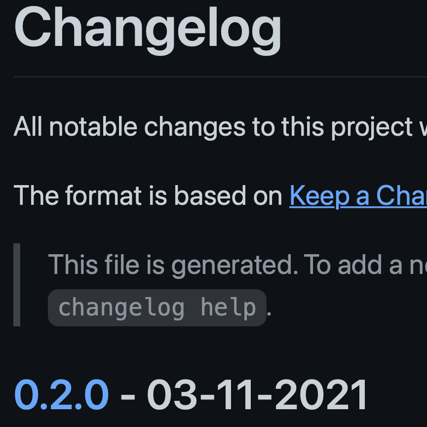
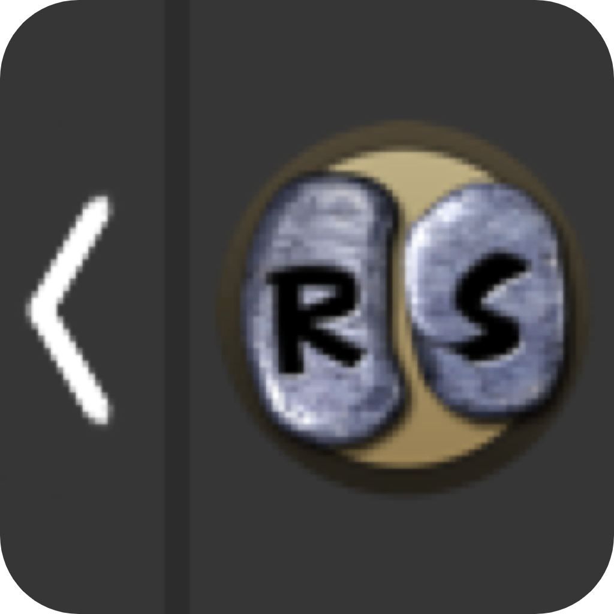
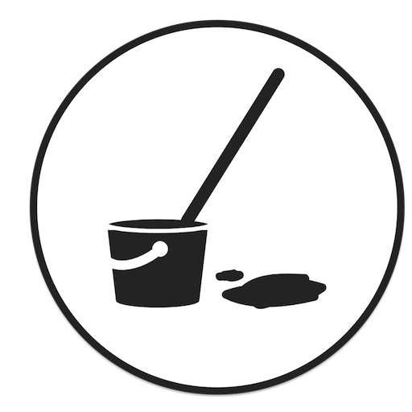

<!-- Howdy, I'm playing around with the new personal README and trying out a few different ideas: 
- Dynamic list of pinned repository logos?
- Most recent star(s)?
-->

#  Patrick Gatewood (he/him)
> Probably clacking on his keyboard at 2 AM

## Some of my favorites:

  
  
  
  
  
  
  
  
  
  
  

