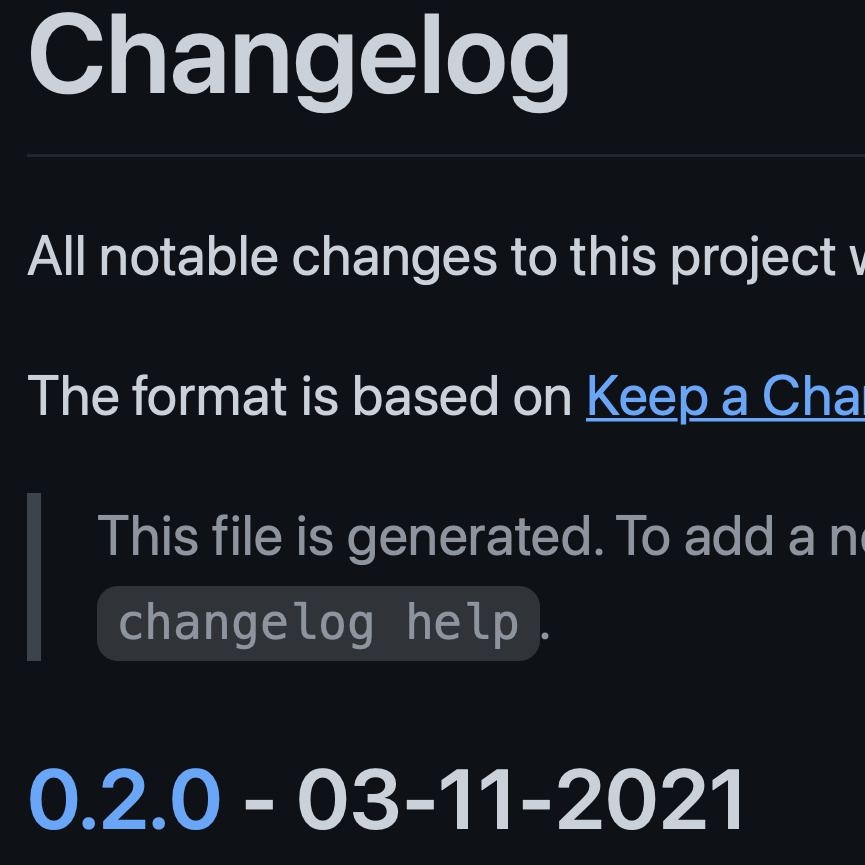
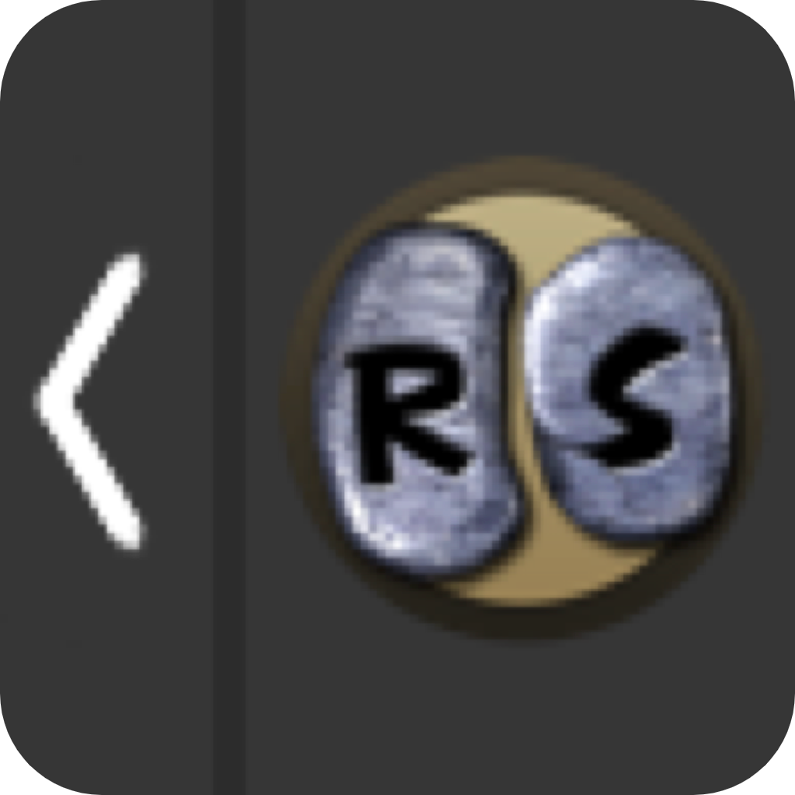

<!-- Howdy, I'm playing around with the new personal README and trying out a few different ideas: 
- Dynamic list of pinned repository logos?
- Most recent star(s)?
-->

<!-- 🙏 https://pragmaticpineapple.com/adding-custom-html-and-css-to-github-readme/-->

  

  <h3>👋 Howdy! I'm Patrick</h3>
  

    Enterprise iOS engineer by day, indie app maker by night. 
    Founder of <strong>Robot Hand, LLC</strong>, shipping tools and apps with a little personality.
  

  

    <a href="https://patrickgatewood.com">patrickgatewood.com</a>
  

 

## 🔨 How I Build

I build software in three realms:

🏢 **At scale**: systems used by millions (Square, WillowTree)

🤖 **Independently**: as founder of [Robot Hand, LLC](https://patrickgatewood.com)

🧪 **Personally**: small, well-crafted apps and tools that keep me curious

## 💼 Enterprise Work

📄 [View my resume](https://github.com/pg8wood/resume/blob/main/PatrickGatewoodResume.pdf)

<table>
  <tr>
    <td width="50%" valign="top">
       
      <h3>Square</h3>
      
Core iOS infrastructure powering millions of sellers. Building AI tooling, transaction security, and developer experience at scale.

    </td>
    <td width="50%" valign="top">
       
      <h3>WillowTree</h3>
      
Shipped high-impact digital experiences for some of the biggest brands in the world, including FOX, PepsiCo, and CFA Institute. Lead architect for tvOS support and large-scale delivery pipelines.

    </td>
  </tr>
</table>

> For case studies and full resume details, visit [patrickgatewood.com](https://patrickgatewood.com).

## 🥇 Project Hall of Fame

<table>
  <tr>
    <td width="50%" valign="top">
       
      <h3>Chosen One</h3>
      
Fast, no-nonsense finger chooser for when the group can't decide. Touch the screen. Get picked.

      

        <a href="https://fingerchooser.app">fingerchooser.app</a>  
        
      

    </td>
    <td width="50%" valign="top">
       
      <h3>Emochi</h3>
      
Lightning-fast emoji utility for macOS.

      

        
      

    </td>
  </tr>
  <tr>
    <td width="50%" valign="top">
       
      <h3>Recipe Nabber</h3>
      
Skip the life stories. Grab the recipe. Strips ads, popups, and distractions from recipe blogs so you can just cook.

      

        
      

    </td>
    <td width="50%" valign="top">
      <h3>taipo</h3>
      
AI-powered CLI that catches and fixes command typos before they break flow.

      
<a href="https://github.com/pg8wood/taipo">View on GitHub</a>

    </td>
  </tr>
  <tr>
    <td width="50%" valign="top">
      <h3>slog</h3>
      
Stop the CLI login slog. Automate your iOS Simulator login flows and get straight to testing.

      
<a href="https://github.com/pg8wood/slog">View on GitHub</a>

    </td>
    <td width="50%" valign="top">
       
      <h3>Changelog Generator</h3>
      
Curbs cumbersome changelog conflicts. Stop wrangling merge conflicts and get back to actual engineering.

      
<a href="https://github.com/pg8wood/changelog-generator">View on GitHub</a>

    </td>
  </tr>
  <tr>
    <td width="50%" valign="top">
       
      <h3>OSRS Touch Bar</h3>
      
Level up your efficiency. Adds Touch Bar support to any Old School RuneScape client.

      
<a href="https://github.com/pg8wood/OSRS-touch-bar">View on GitHub</a>

    </td>
    <td width="50%" valign="top">
    </td>
  </tr>
</table>
